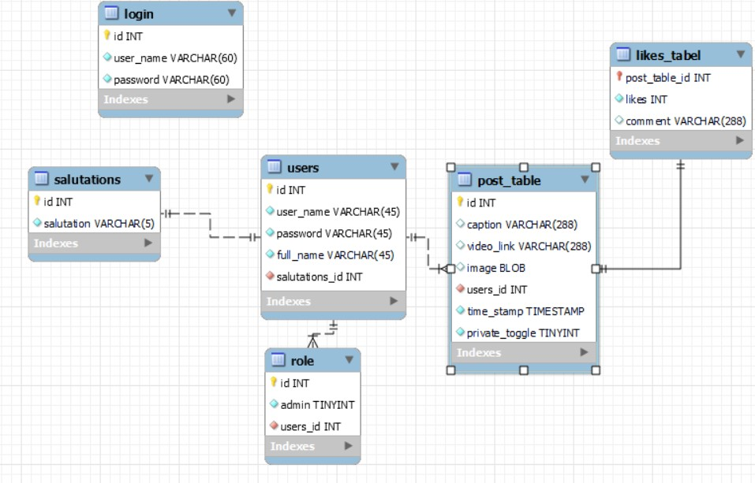

# ibm-Virtual-white-board

### Filip Filipovic

### Role: Backend

#### How to run:

The database is run in a docker container. To run the container run this command 

> docker compose up -d

Although I would have loved to dockerized the spring application and make it easier to run, I did not have time to learn to do so. So you need an IDE that supports Spring and Java to run the allocation.

application port : 8080

I used Liquibase to migrate all the SQL tables, and soon as you run the project it should populate the database with all the necessary tables and data.

#### Language:

I choose to create the application in Java spring boot since I have a deeper understanding and knowledge of the Spring framework.
Altho spring shines in distributed systems architecture, it is still a viable choice for monolithic applications.

### Postman api Endpoints:

There is a folder in the project called postman endpoints in the documentation folder, where you can import a folder with the different endpoints used for this project.

else Here are some API's

GET
> http://localhost:8080/users/users 

POST
> http://localhost:8080/users/create 

 Body {
    "userName": "Bertha",
    "password": "test123",
    "fullName": "Bertha Berthasen",
    "salutationsId": 2
}

PUT
> http://localhost:8080/users/update/1
body {
    "userName": "sam Wise",
    "password": "test123",
    "fullName": "Sam Wise Samsen",
    "salutationsId": 2
}

POST
> http://localhost:8080/feed/post/1
body {
    "caption":"test",
    "videoLink":"some link",
    "image": null,
    "usersId": 1,
    "privateToggle": 0
}

GET (gets all posts)
> http://localhost:8080/feed/

#### ER-Diagram:

Here is the ER diagram I made for Virtual white board, there were many iterations, and I'm not totally satisfied.

As seen in the diagram there is a table called login which I added at the end and didn't have time to incorporate into the project.
 

